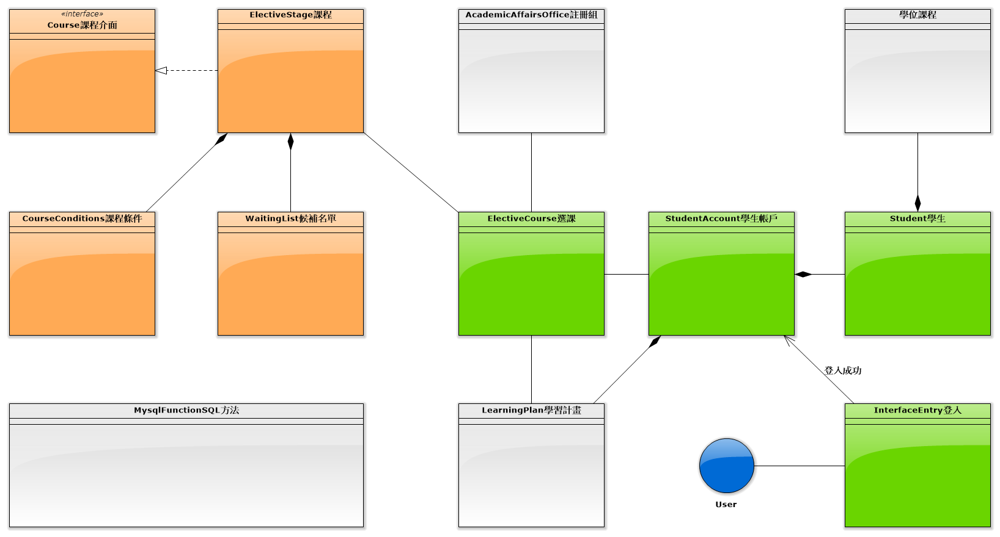
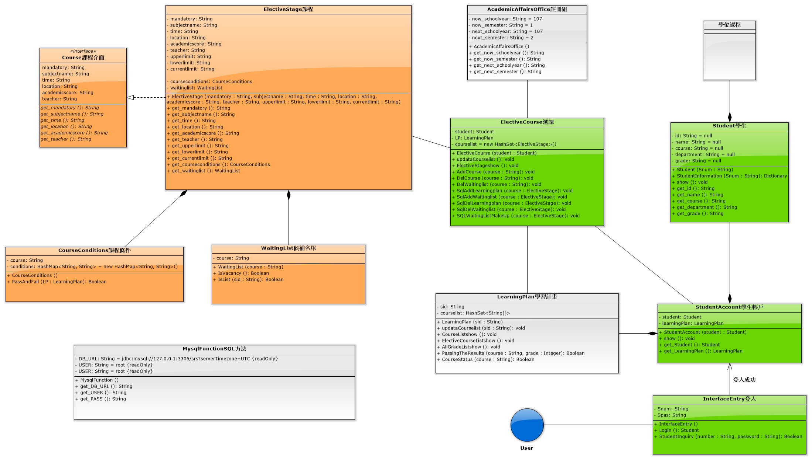
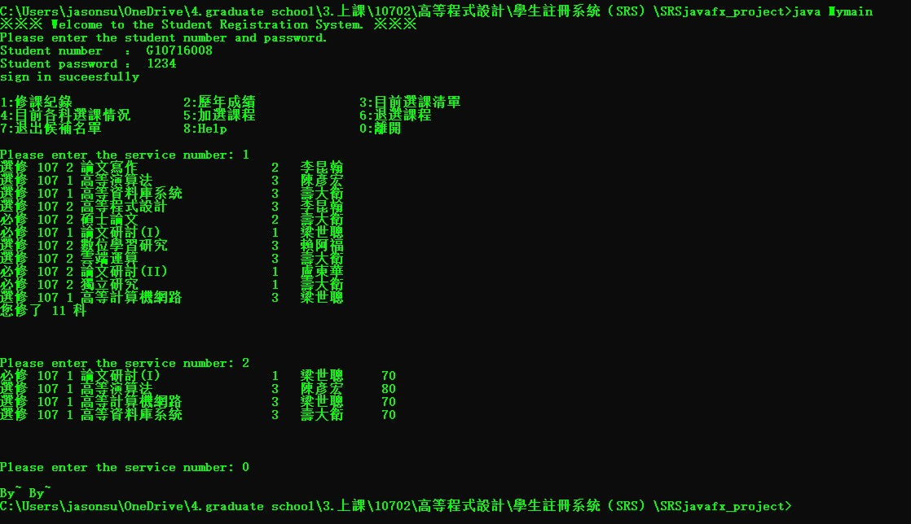

# 10702 高等程式設計實作專案
該範例專案名為「<b>Student Registration System (SRS)</b>」，
以依照<a href="document/STUDENT REGISTRATION SYSTEM (SRS) CASE STUDY.pdf">需求規範</a>找出類別及其之間的關係並加以實作。使用Java撰寫。

#### 版本
* java version "1.8.0_211"

#### 配置
* <a href="src/MysqlFunction.java">src/MysqlFunction.java</a>底下可自行配置Database相關配置資訊。
* <a href="db/">db/</a>有提供Database範例，請使用Navicat Lite free匯入。

#### 安裝&執行
1. 請確保PC已安裝 MySQL 需要驅動包
    > 可參考：http://www.runoob.com/java/java-mysql-connect.html
2. 編譯
    > javac -encoding UTF-8 Mymain.java
3. 執行
    > java Mymain

#### 類別圖
類別圖1

類別圖2

#### 執行結果
